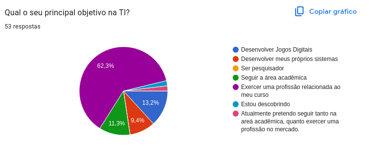
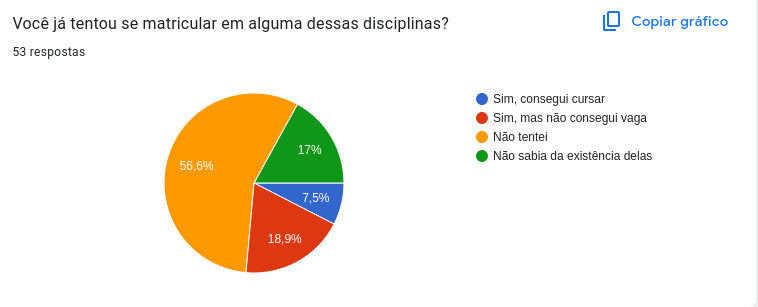
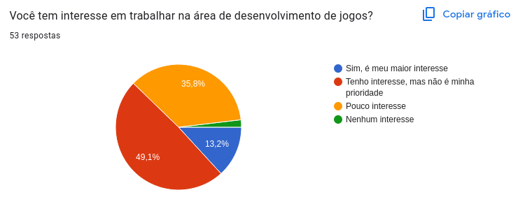
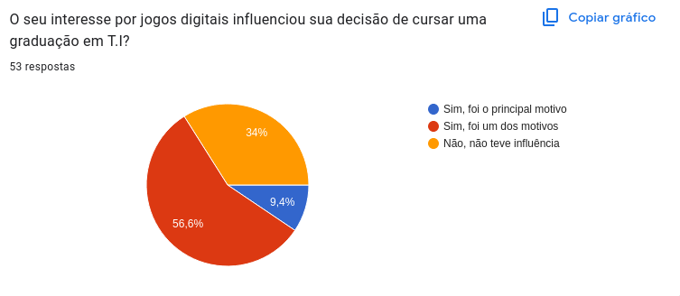
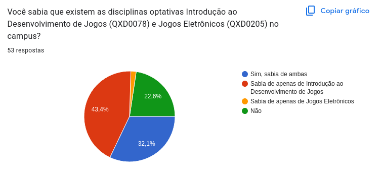
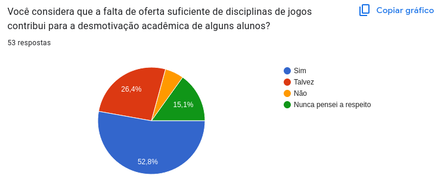
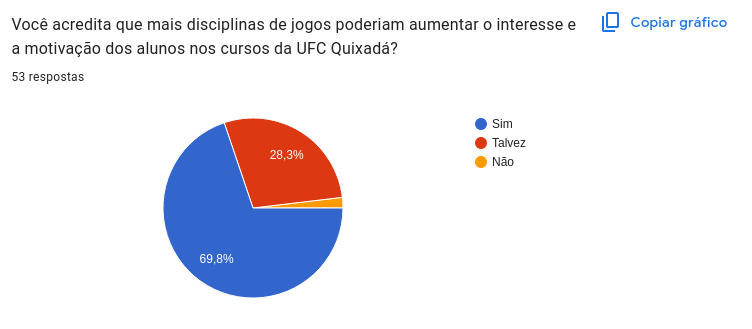
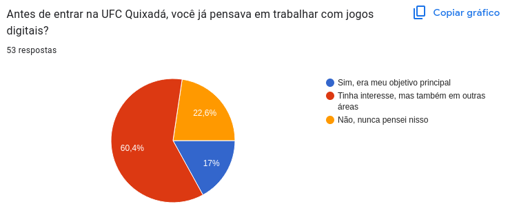
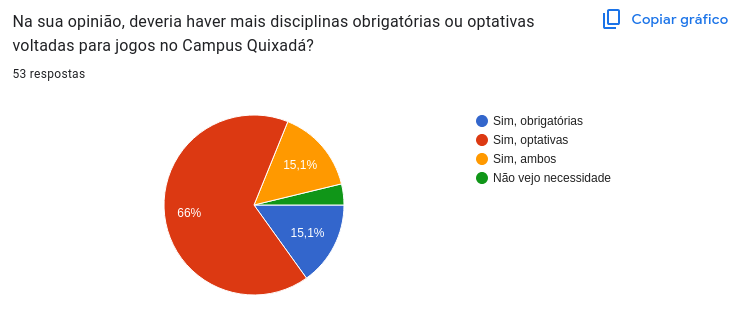

# Fórmulário e Dados coletados para o artigo dos EU 2025 UFC Quixadá

## A DESMOTIVAÇÃO ACADÊMICA AO DESENVOLVIMENTO DE JOGOS DIGITAIS NO CAMPUS UFC QUIXADÁ

O formulário não está mais disponível para ser preenchido, mas as perguntas realizadas podem ser consultadas em [Formulário](forms.md).

Os dados coletados estão na integra no arquivo [coleta.csv](coleta.csv).

## Resultados

Foram coletadas 53 participações no período de 23 de setembro de 2025 a 14 de outubro de 2025.

Algumas respostas significativas estão espressas nos gráficos abaixo.

